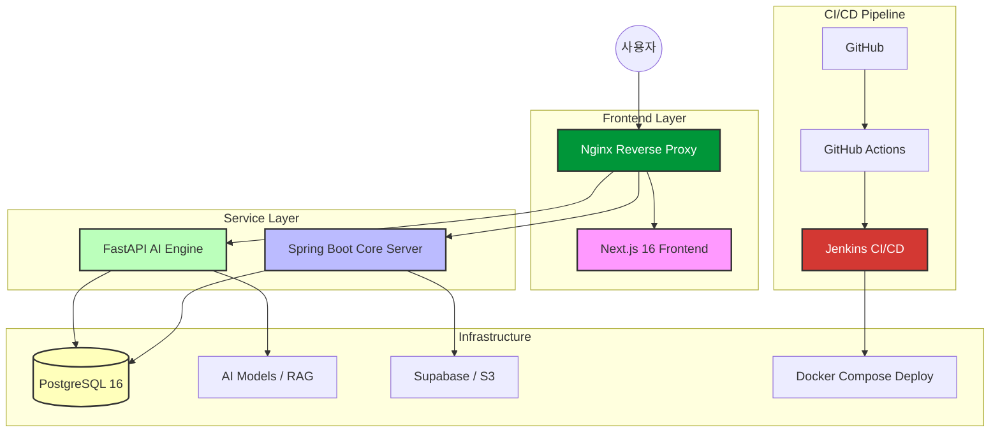
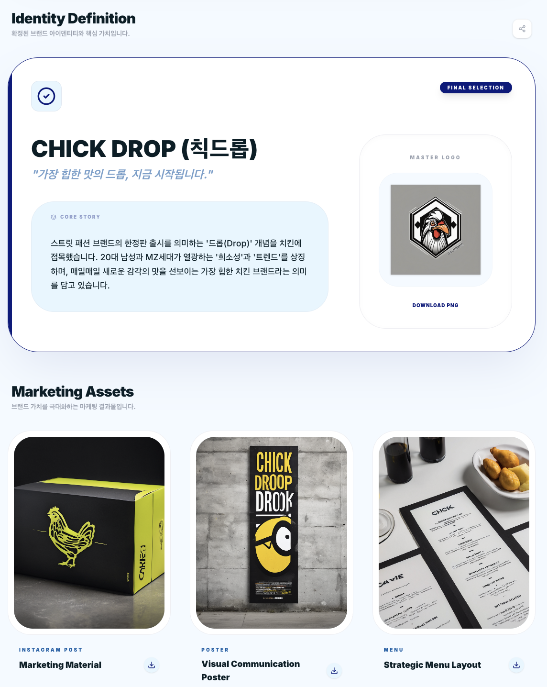
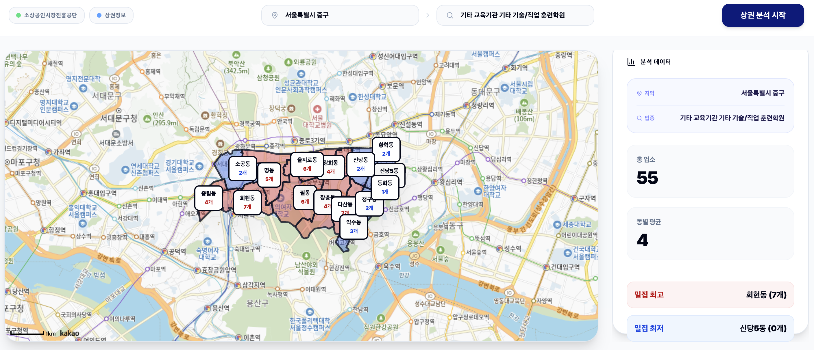
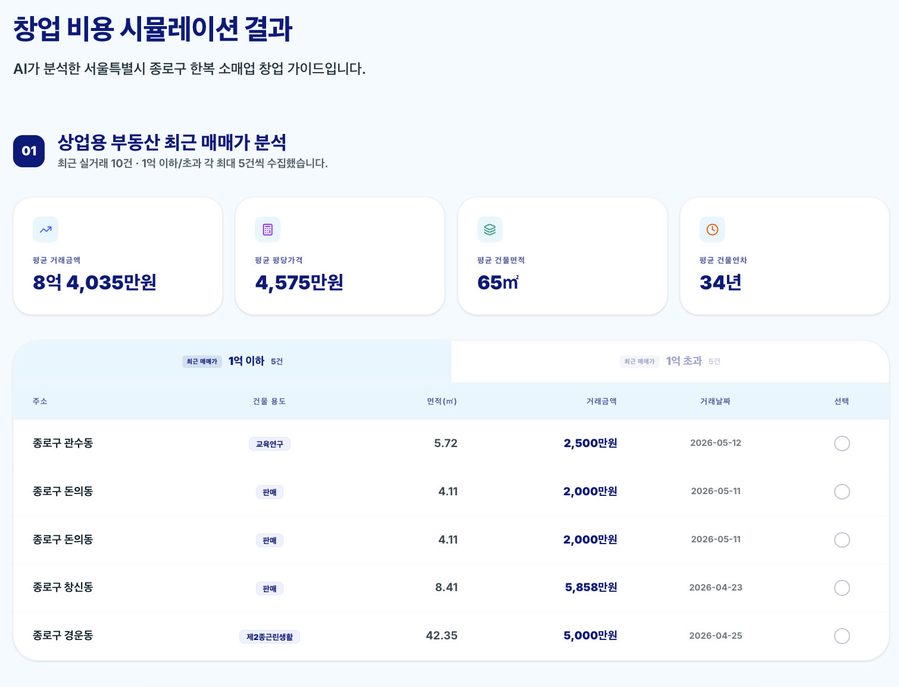
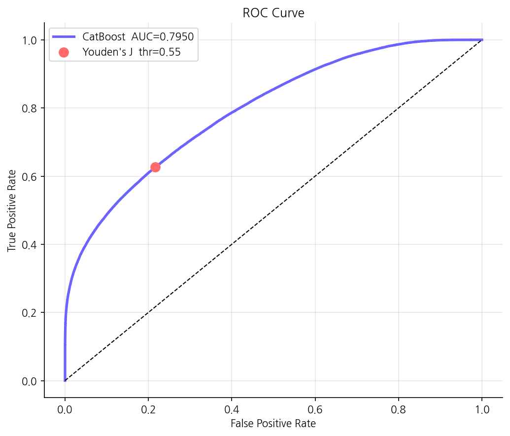
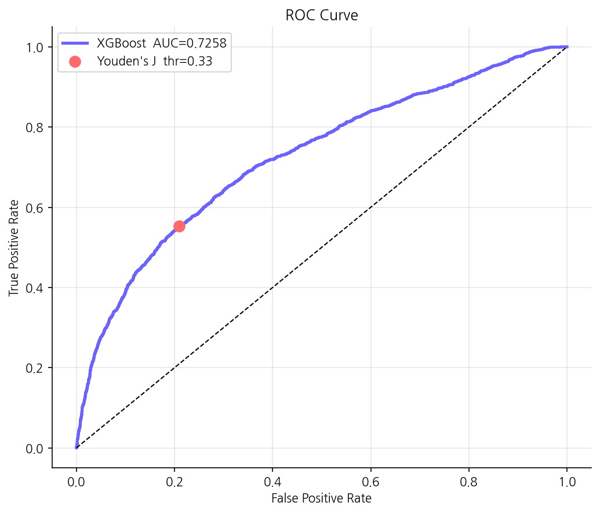

<div align="center">
  <h1>🌌 Nexus (넥서스)</h1>
  <p><b>AI 기반 통합 미디어 브랜딩 및 데이터 기반 창업 지원 플랫폼</b></p>

  [](https://nextjs.org/)
  [](https://spring.io/projects/spring-boot)
  [](https://fastapi.tiangolo.com/)
  [](https://www.postgresql.org/)
  [](https://www.docker.com/)
</div>

---

## 📅 1. 프로젝트 정보 (Project Info)
- **개발 기간**: 2026.03.27 ~ 2026.05.15
- **팀 구성**: 5명 (PM 1, PL 1, DEV 3)

### 👥 팀원 및 역할 (Team Members)

| 역할 | 이름 | 담당 업무 (Main Responsibilities) |
| :--- | :--- | :--- |
| **PM** | **유재복** | AI 브랜딩, 기획/개발환경 설계 및 세팅, 인프라 구축(MSA), CI/CD 자동화 |
| **PL** | **탁유제** | 창업 시뮬레이션, 상권 분석, WBS 작성, AI 모델 학습 및 검증 |
| **DEV** | **문광명** | 인증(로그인/회원가입), 커뮤니티, 공동구매, 실시간 채팅, 정책 정의, 전문가 매칭 |
| **DEV** | **최지원** | 창업/고용 가이드, 지원금 조회, 문서 취합 및 관리, 테스트 케이스(TC) 작성 |
| **DEV** | **강민재** | 매출 데이터 업로드 및 정제, 매출 분석 AI 엔진, 매장 운영 분석 대시보드 |

---

## 🚀 2. 프로젝트 개요 (Overview)
**Nexus**는 소상공인과 예비 창업자를 위한 **All-in-One 지능형 창업 지원 플랫폼**입니다. 단순한 정보 제공을 넘어, AI 기술을 활용하여 브랜드 아이덴티티를 구축하고 데이터에 기반한 실질적인 사업 의사결정을 돕습니다.

- **브랜드 정체성 확립**: AI가 네이밍부터 로고, 슬로건까지 맞춤형 브랜딩 에셋을 생성합니다.
- **리스크 최소화**: 상권 데이터와 비용 시뮬레이션을 통해 창업 초기 시행착오를 줄입니다.
- **데이터 기반 운영**: 매출 예측 및 고객 감성 분석을 통해 지속 가능한 성장을 지원합니다.

---

## ✨ 3. 핵심 기능 (Key Features)

### 🎨 AI 브랜딩 엔진 (AI Branding)
- **Multi-Stage Workflow**: 단순 생성을 넘어, LLM 기반의 'Self-Correction Loop'를 통해 네이밍과 슬로건의 품질을 자동 검증하고 개선합니다.
- **이미지 생성**: Stability AI 등 최신 이미지 모델을 연동하여 업종별 최적화된 로고를 즉시 제작합니다.

### 🏢 창업 시뮬레이션 (Startup Simulation)
- **상권 분석**: PostgreSQL의 공간 쿼리와 공공 데이터를 결합하여 해당 지역의 업종 밀집도와 유동인구를 분석합니다.
- **비용 예측**: 지능형 알고리즘을 통해 인테리어, 임대료, 초기 인건비 등 상세 창업 비용을 예측합니다.

### 💰 맞춤형 정책 매칭 (Policy Matching)
- **실시간 데이터 연동**: '중소벤처24' API와 연동하여 최신 정부 지원금 및 정책 정보를 실시간으로 수집합니다.
- **지능형 검색**: Gemini 임베딩 기반의 시맨틱 검색을 통해 사용자 상황(지역, 업종, 창업 단계)에 가장 적합한 정책을 추천합니다.

---

## 🏗️ 4. 시스템 아키텍처 (System Architecture)

Nexus는 확장성과 유지보수성을 극대화하기 위해 **도메인 중심(Domain-Driven) 아키텍처**와 **마이크로 서비스 지향적 구조**를 채택했습니다.



---

## 🖥️ Service Preview (서비스 프리뷰)

| 주요 기능 | 인터페이스 미리보기 | 기능 상세 |
| :--- | :---: | :--- |
| **AI 브랜딩 결과물** | <details><summary>📸 이미지 보기</summary></details> | 네이밍, 슬로건, 로고 및 브랜드 스토리를 패키지로 제공 |
| **상권 분석 대시보드** | <details><summary>📸 이미지 보기</summary></details> | 히트맵 기반 상권 밀집도 및 유동인구 시각화 분석 |
| **창업 비용 시뮬레이션** | <details><summary>📸 이미지 보기</summary></details> | 초기 투자금 및 운영 비용에 따른 손익분기점 예측 |

---

## 🤖 5. AI & Data Engineering (AI/데이터 기술 스택)

Nexus의 핵심 경쟁력은 단순한 인터페이스가 아닌, **데이터 기반의 지능형 엔진**에 있습니다.

### 🧠 5.1 생성형 AI 및 LLM 파이프라인 (LLM & Generative AI)
- **Gemma-4-31b Engine**: Google Gemini API를 통해 제공되는 고성능 언어 모델을 메인 브레인으로 채택하여, 다단계 브랜딩 인터뷰 및 전략 수립을 수행합니다.
- **CLIP 기반 Alignment Score**: 생성된 시각 에셋과 브랜드 키워드 간의 의미적 일치도를 CLIP 모델로 정량화합니다.
  - **디자인의 정량적 검증 수식**:
    $$Score_{final} = \text{clamp}\left(\frac{Score_{raw} - 0.15}{0.35 - 0.15}, 0, 1\right) \times 100$$
- **Self-Correction Loop**: 생성된 브랜드 에셋을 KIPRIS(상표권) API와 연동하여 실시간으로 대조합니다. 이를 통해 법적 안정성을 선제적으로 확보하며, 유사 상표 발견 시 AI가 스스로 파라미터를 조정하여 재생성을 시도하는 고도화된 품질 보증 루프를 수행합니다.
- **Multimodal Asset Generation**: Stability AI 연동을 통해 브랜드 정체성이 반영된 고해상도 로고 및 마케팅 에셋을 자동 생성합니다.

### 📈 5.2 정밀 분석 및 예측 모델 (Machine Learning & DL)
- **TimesFM (Time Series Foundation Model)**: Google Research에서 개발한 최신 시계열 파운데이션 모델을 핵심 엔진으로 활용하여 예측 성능을 극대화했습니다.
  - **Zero-Shot Forecasting**: 방대한 데이터로 사전 학습되어 별도의 추가 학습 없이도 즉각적이고 정교한 예측 결과를 도출합니다.
  - **Transformer 기반 구조**: 시계열 데이터에 최적화된 Transformer 디코더를 통해 복잡한 비선형 패턴과 맥락을 깊이 있게 분석합니다.
- **Survival Prediction Engine**: 서울시 공공 데이터를 학습한 **XGBoost** 및 **CatBoost** 모델을 통해 25개 자치구 및 14개 업종별 창업 생존 확률을 예측합니다.
- **Ensemble Recommender**: Jaccard, Cosine, KNN 알고리즘을 결합한 앙상블 유사도 모델을 통해 기존 설비를 활용한 최적의 업종 전환(Pivot) 전략을 제안합니다.

#### 📊 모델 성능 지표 (Model Performance)
학습된 모델의 신뢰도를 보장하기 위해 ROC Curve와 AUC 지표를 통해 지속적으로 성능을 검증합니다.

| CatBoost ROC Curve | XGBoost ROC Curve |
| :---: | :---: |
|  |  |

### 🔍 5.3 지능형 검색 및 RAG (Retrieval-Augmented Generation)
- **Semantic Policy Search**: '중소벤처24'의 비정형 정책 데이터를 **Gemini Embedding**으로 벡터화하여 **PostgreSQL pgvector**에 저장, 사용자 상황에 최적화된 정책을 의미론적으로 추출합니다.
- **Vector-based Industry Mapping**: 사용자 대화 맥락을 실시간 임베딩하여 4,000여 개의 한국 표준 산업 분류 데이터 중 가장 적합한 업종을 정밀 매핑합니다.

---

## 📂 6. 프로젝트 구조 (Directory Structure)

```text
nexus/
├── frontend-next/         # Next.js 16 프론트엔드 (App Router)
│   ├── app/               # 페이지 라우팅 및 서버 컴포넌트
│   ├── components/        # UI(Shadcn), Auth, Layout 등 재사용 컴포넌트
│   ├── lib/               # API 클라이언트 및 공통 유틸리티
│   └── store/             # Zustand 기반 전역 상태 관리
├── backend-spring/        # Spring Boot 3.3 코어 백엔드
│   ├── src/main/java/     # 비즈니스 로직, 엔티티, 보안(Security) 구현체
│   ├── src/main/resources/# 애플리케이션 설정 및 데이터베이스 마이그레이션
│   └── config/checkstyle/ # 코드 품질 관리를 위한 스타일 규격
├── backend-fastapi/       # FastAPI AI 서비스 백엔드
│   ├── app/               # AI 도메인 로직 및 LangChain 파이프라인
│   ├── scripts/           # ML 모델 학습 및 데이터 정제 스크립트
│   └── main.py            # AI 서비스 엔드포인트 및 서버 설정
├── db/                    # DB 초기화 및 Docker 설정 파일
└── docker-compose.yml     # 멀티 컨테이너 오케스트레이션 및 네트워크 설정
```

---

## 🛠️ 7. 기술 스택 (Technical Stack)

| 구분 | 기술 (Technology) | 상세 내역 |
| :--- | :--- | :--- |
| **Frontend** | `Next.js 16`, `React 19`, `Tailwind CSS` | 고성능 UI/UX 및 서버 사이드 렌더링 |
| **Backend (Core)** | `Spring Boot 3.3`, `Java 17`, `JPA` | 안정적인 비즈니스 로직 및 API 관리 |
| **Backend (AI)** | `FastAPI`, `LangChain`, `LLM`, `XGBoost`, `CatBoost` | 고성능 AI 엔진 및 지능형 분석 파이프라인 |
| **Database** | `PostgreSQL 16`, `Redis`, `Supabase Storage` | 데이터 영속성 관리 및 실시간 캐싱 |
| **DevOps** | `Docker`, `Docker Compose`, `Jenkins`, `Nginx` | 일관된 개발 및 배포 환경 보장 |

---

## ⚙️ 8. 운영 및 배포 전략 (Deployment & Operation Strategy)

Nexus는 특정 클라우드 플랫폼에 종속되지 않는 **인프라 자립형 하이브리드 배포 전략**을 취하고 있습니다.

### 🏗️ 인프라 구성
- **Hybrid Infrastructure**: **Ubuntu Server** 환경에서 **Docker Compose**를 통해 각 마이크로서비스를 컨테이너화하여 관리합니다.
- **CI/CD Pipeline**: GitHub에 코드 푸시 시 **GitHub Actions**가 일차적 빌드를 검증하며, **Jenkins**가 실제 운영 서버에 접속하여 무중단 배포를 수행합니다.
- **Reverse Proxy**: **Nginx**를 최전방에 배치하여 SSL 인증 처리 및 각 서비스(Spring, FastAPI, Next.js)로의 요청을 안전하게 라우팅합니다.

### 🔒 보안 및 환경 관리
- **Secret Management**: 모든 민감 정보는 `.env` 파일로 관리되며, 협업을 위해 `env.example` 파일을 가이드라인으로 제공합니다. 운영 서버의 Secrets는 Jenkins 파이프라인 내에서 암호화되어 관리됩니다.

### 🏃 시작하기 (Quick Start)
```bash
# 1. 인프라 기동
docker-compose up -d

# 2. 개별 서버 실행 (개발 모드)
# FastAPI: cd backend-fastapi && python -m app.main
# Spring: cd backend-spring && ./gradlew bootRun
# Next.js: cd frontend-next && npm run dev
```

---

## 💎 9. 코드 품질 및 협업 (Quality & Collaboration)

PM의 주도 하에 AI와 인간 개발자가 조화롭게 협업할 수 있는 시스템을 구축했습니다.

- **AI-Human Collaboration Control**: `.ai-rules.md`와 `.agent-conventions.md`를 정의하여 AI 코딩 어시스턴트가 팀의 컨벤션을 이탈하지 않도록 엄격히 통제하고 높은 수준의 코드 품질을 유지했습니다.
- **Multi-Language Linting & Formatting**: 각 프레임워크 특성에 맞는 최적의 린터와 포매터를 도입하여 코드 일관성을 확보했습니다.
  - **Java (Spring)**: `Checkstyle`을 통한 표준 코딩 가이드 준수.
  - **Python (FastAPI)**: `Ruff`를 도입하여 고성능 린팅 및 자동 코드 정제 수행.
  - **TypeScript (Next.js)**: `ESLint`와 `Prettier`를 연동하여 프로젝트 전반의 스타일 자동화.
- **전략적 기술 병목 해결**: 5~6인 규모의 한정된 리소스 내에서 인증 로직, AI 연산 등 기술적 병목 구간에 인력을 전략적으로 배치하여 개발 속도와 안정성을 동시에 확보했습니다.
- **Agile & Quality Assurance**: **WBS 기반의 철저한 일정 관리**와 **테스트 케이스(TC) 기반의 검증 프로세스**를 통해 단 하나의 크리티컬 이슈 없이 데드라인 내 프로젝트를 완수했습니다.

---
<div align="center">
  <p>© 2026 Nexus Team. All rights reserved.</p>
</div>
